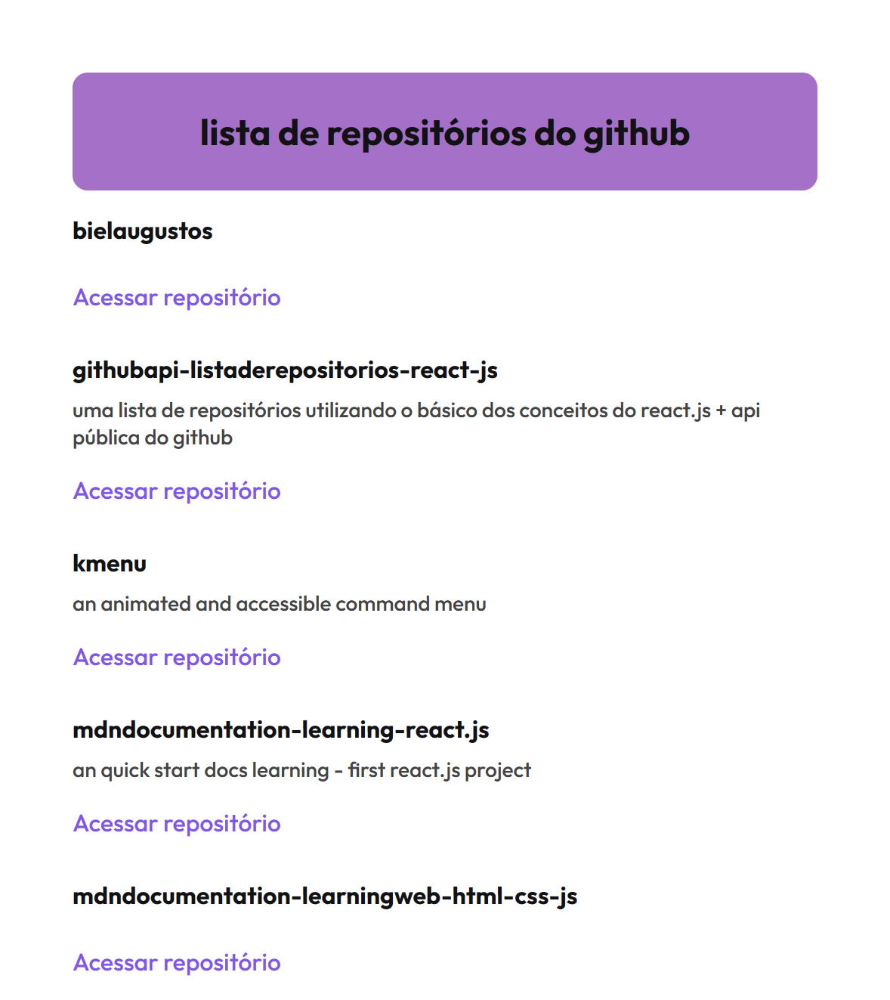

### `hello codespace !`


primeiro confira se a versão do node instalada corresponde a do desenvolvimento do projeto, digitando no terminal:

```
node -v 
```

 a versão de desenvolvimento do projeto é a v12.22.12

### após a instalação do node, execute :
```
npm install
```

isso irá instalar as bibliotecas e a pasta node_modules

### para iniciar o projeto  :

```
npm run dev
```



#### `githubapi-listaderepositorios-react-js`
